# Axon Ivy Express

Axon Ivy Express is an ad-on module for Axon Ivy Portal. It enables you – as a business user – to create your own process applications and share them with your colleagues. These capabilities are also known as No-Code Application Platforms or Citizen Developer Platforms. Therefore, it is the perfect tool for you to digitize your processes and create standardization, reliability and traceability. Some of the key features of Axon Ivy Express are:
   * It is a No Coding Toolset, allowing business users without an IT background to create processes.
   * The Axon Ivy Portal Integration, allows business users to implement processes without IT department involvement.
   * The Seamless Integration into Axon Ivy allows you to make use of standard features like email notifications, task delegation, etc.
   * The Powerful Toolset allows you to create processes, define different task types, set responsibilities and due dates and define user dialogs for each task.

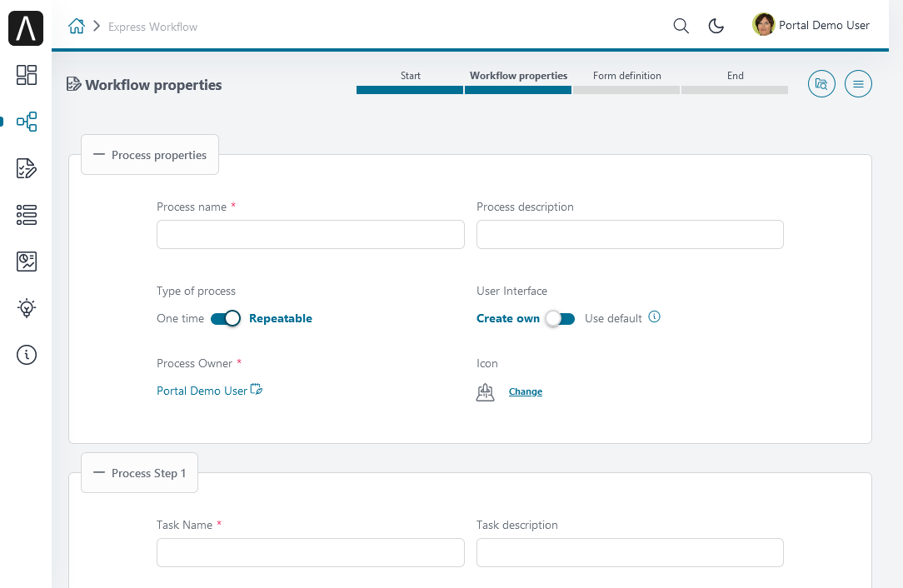

## Demo

1. Click on **Create Express Workflow**.

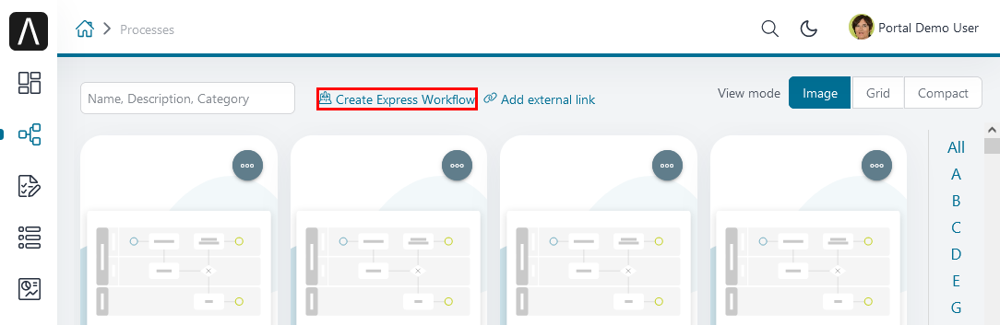

2. The **Express Workflow** editor is opened.
3. Define the **Type of process**:
   * Use the option *One time* if you want to execute the process only once.
   * Use the option *Repeatable* if you want to save the process for repetitive use. The process will automatically be deployed and added to the Full Process List page.
4. Define your **User Interface** :
   * With the option Create own you can create your own user dialog for each process step
   * With the option Use default, the user dialogs will automatically be generated by Axon Ivy Express
5. Provide a descriptive name under **Process name**
6. You may add a description under **Process description**. We strongly encourage you to use the description to provide details about your process.
7. Click on the link **Change** beside Icon to select the icon best suited for your process.

8. The first process step is already available for configuration.
9. You may add further process steps using the button **Add process step**
10. You may delete unnecessary process steps using the button **Remove process step**
11. For each process step,
   * select the **Task Type** see [Express Workflow task types](https://market.axonivy.com/market-cache/portal/portal-guide/11.1.0/portal-user-guide/axon-ivy-express/index.html#express-workflow-task-types).
   * provide a descriptive name in **Task Name**
   * provide an optional description in **Task description.**
12. For *One time* process type, the first process step defines the users or roles under **Able to start** who can start the process

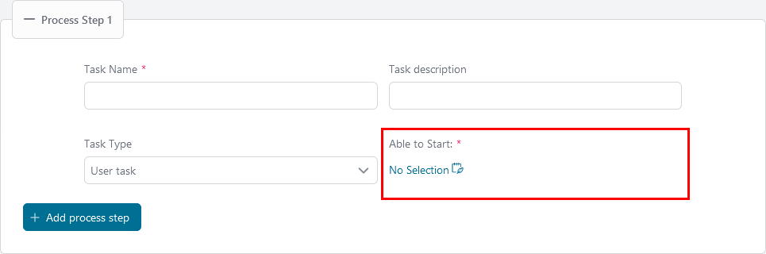

13. For all other process steps define the user or roles who are responsible to execute the task in **Responsible**.

14. For each process step except the first define the time before the task expires in **Expiry in days**
15. End the configuration of each process step by pressing **Next**

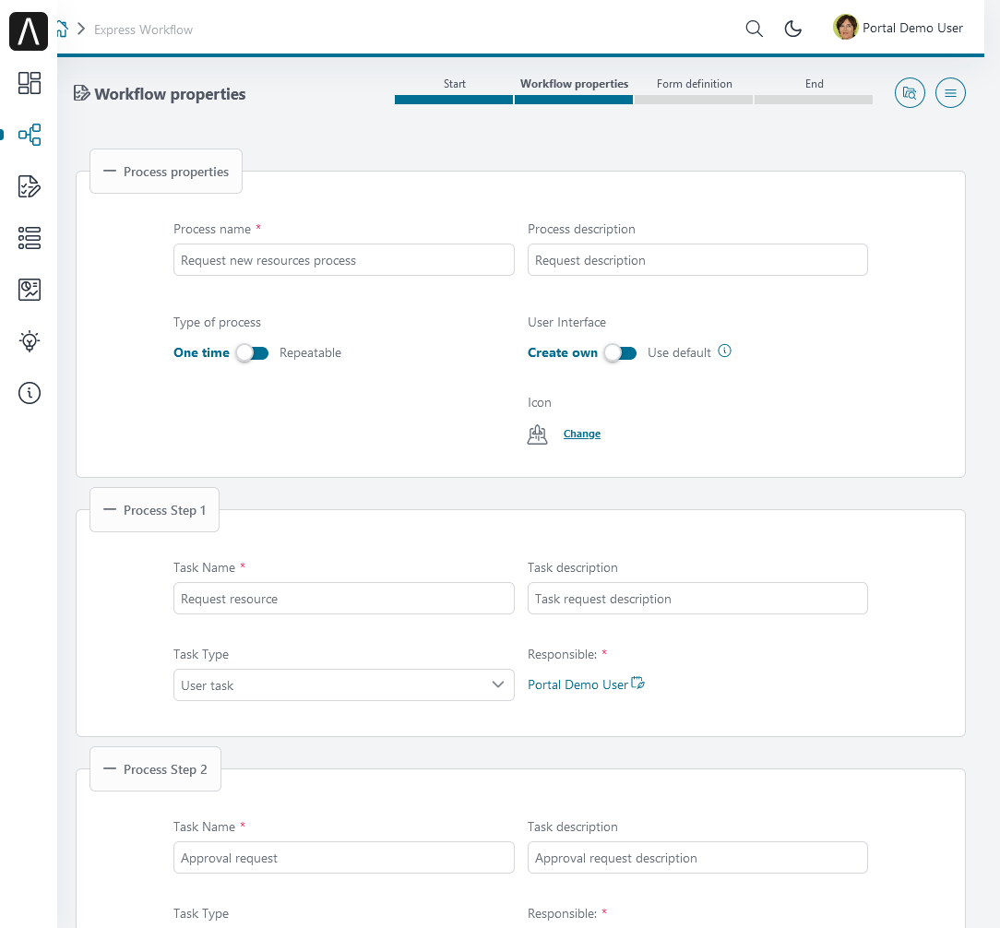

**Express Workflow task types**

|**Task type**|**Description**|
|-------------|:-------------:|
|**User Task**|For this task the user can define a UI|
|**User Task with Email**|In addition to the normal User Task, the user can send an Email directly from the Axon Ivy Portal, without the need to change to another system|
|**Information Email**|This email can be defined by the creator of the Express Workflow and will be sent automatically without user action|
|**Approval**|This task type creates a approval task|

16. Depending on the task type of the first process step, a different editor is opened. For both user task and task with email, the dialog editor is opened.
17. For each data item you need in your process, select an input element.
18. Provide a descriptive name for the input in **Label**.
19. Select the input type in **Input type**.
20. Select if the input of this data item is required or not
21. Use the button Create to create the input element
22. The created element appears in the list Available form elements
23. To delete input elements you don’t need, klick its trash button.
24. Drag and Drop the input elements into one of the areas of the dialog editor
25. To remove an input element from the dialog, use the **Delete** button
26. To preview your dialog, press the **Preview** button to define an additional process step, klick the button **Next**.

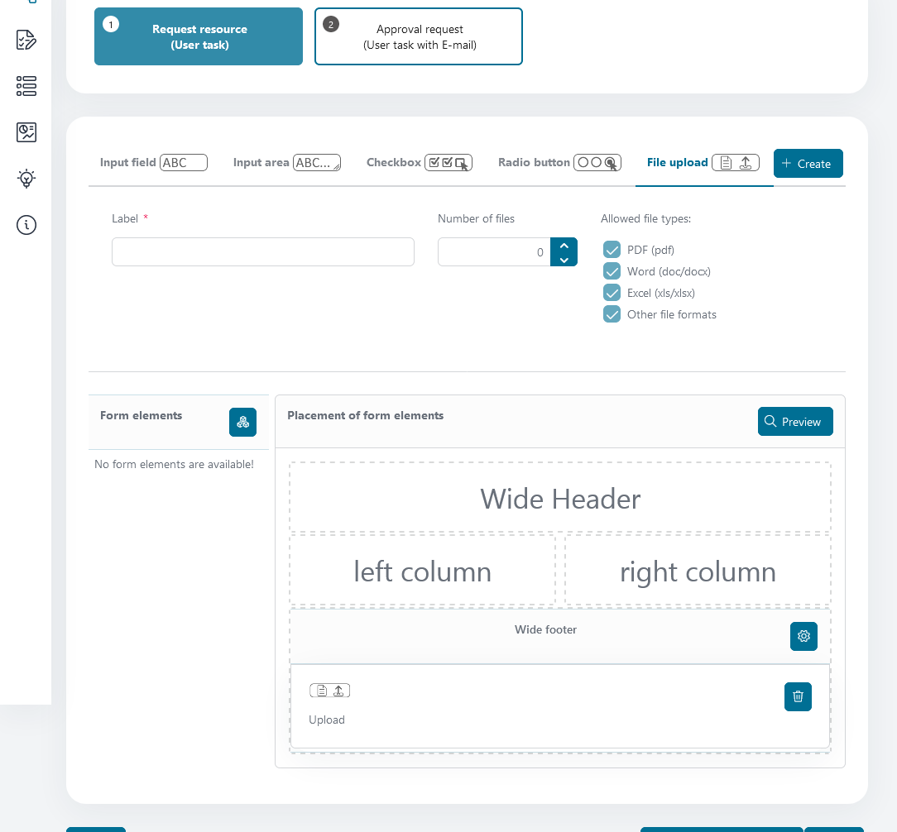

The results of all previous tasks are included in follow-on tasks in a read-only view, so that the user sees the whole history.

**Express Workflow input elements**

|**Input element**|**Description and options**|
| --------------- |:-------------:|
|**Input field**|Input field for text, numbers or dates      * Text field      * Number field      * Date picker|
|**Input area**|Text input field between 1 and 10 rows|
|**Checkbox**|List of elements which allows the user a multiple selection|
|**Radio button**|List of elements which allows the user a single selection|
|**File Upload**|Provides a file upload dialog to the user. You may define:      * Allowed file types     * Number of allowed attachments|

27. For process steps with the task type user task with email/information email, the email editor is opened.
28. Specify the addresses of the email recipients. Separate them by commas.
29. The response email email address is optional.
30. Specify the subject of the email.
31. Specify the email text.
32. Optionally, include attachments.
33. Use the button **Next** to define the next process step

**Express Business Summary**

After you have completed an Express workflow, you can check its summary data by accessing its **Business Details** page.

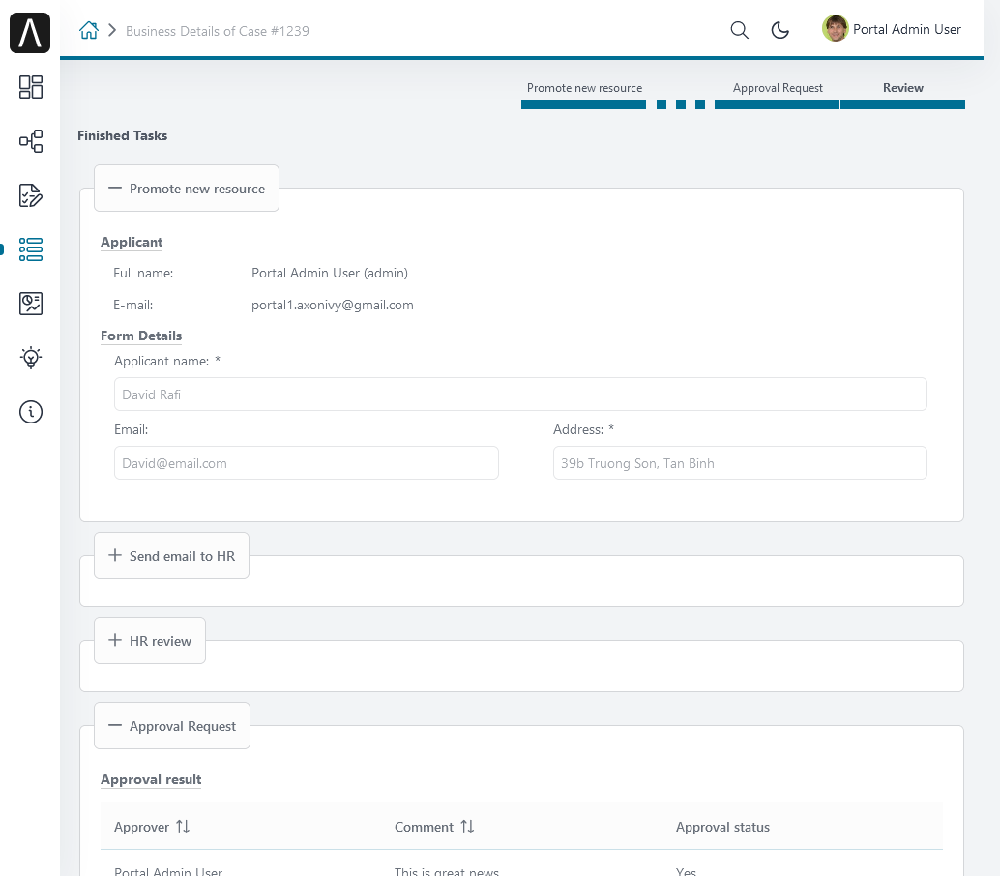

**Axon Express Management**

With Axon Express Management, an administrator can import/export Express workflows in JSON format. You find this feature in the *Admin Settings <settings-admin-settings>*.

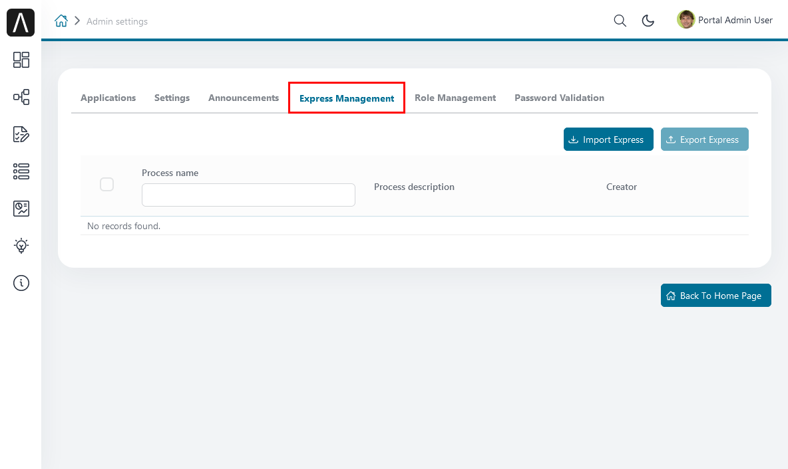

To access this feature, you need to be granted the role **AXONIVY_PORTAL_ADMIN**.

**HowTo: Export an Express Process**

Select the workflows you want to export in Express workflows table. The selected workflows will be exported to a JSON file.

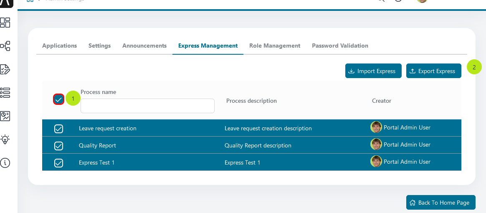

   1. You can select multiple workflows by clicking the checkbox ALL.
   2. After you selected some workflows, click the **Export Express** button.

The Export dialog will display and show the workflows selected for export.

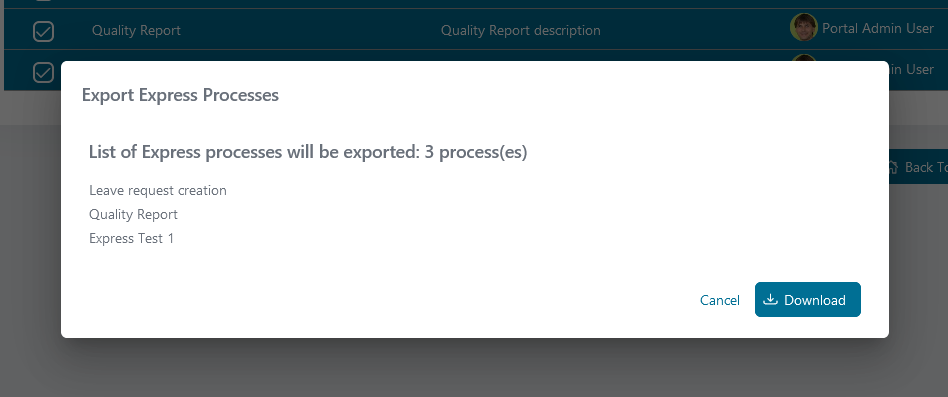

Review your selection, then press the Download button to download the selected workflows.

**Important**: The export file is a JSON file. It contains a version of Axon Ivy Express and Express process data. Don’t edit this file manually.

**HowTo: Import an Express Process**

The Import Express Process function allows the Administrator to import Express processes into the Portal from a backup file.
Press the **Import Express** button, Import Express dialog will display. Once the **Import Express** dialog is open, press the Select button and choose the Express JSON file that contains the workflows you want to import.

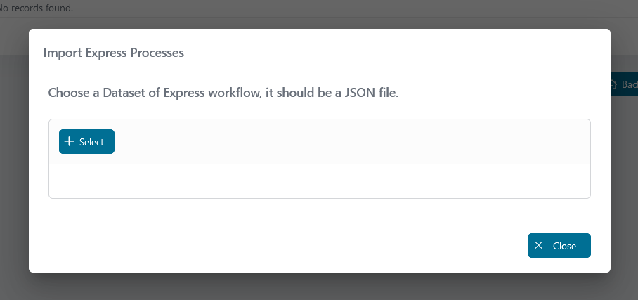

Then, press the **Deploy** button and wait for the deployment process.

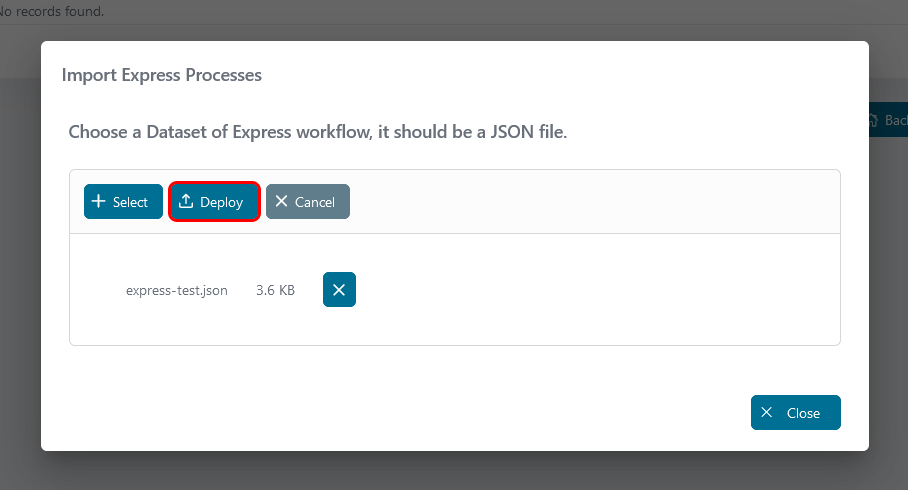

After the deployment process is completed, an output log panel will be displayed. You can see all the information collected during the deployment process.

Now, if the deployment process is successful, your workflows are imported and an administrator can check and/or edit them before they are ready to use.

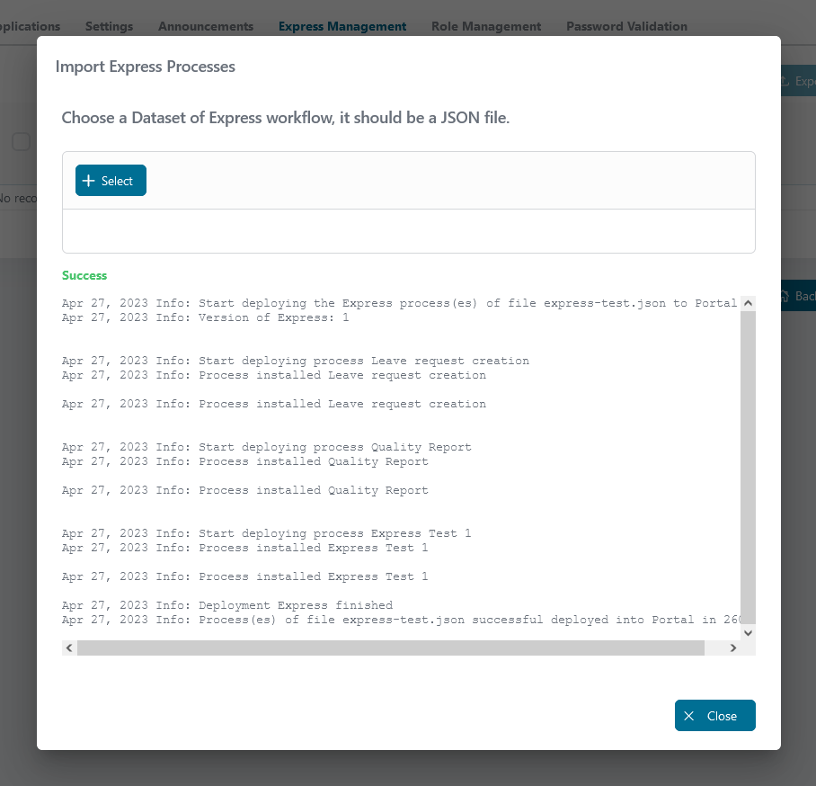

**Ad Hoc Process**

Axon Ivy Express also provides an ad hoc process feature. Once Express is deployed, you can start an ad hoc process for any task. Ad hoc processes allow you to define more process steps and will be executed before the current task.

Start an ad hoc process by clicking on the menu icon at the top right in your task, then click on **Start Adhoc**.

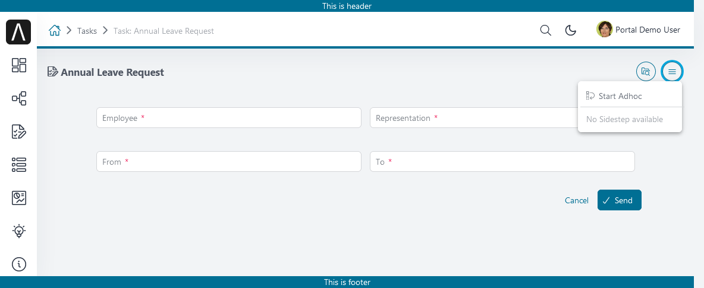

Save the data of your current task before you start the ad hoc process.
Then, define your ad hoc process.

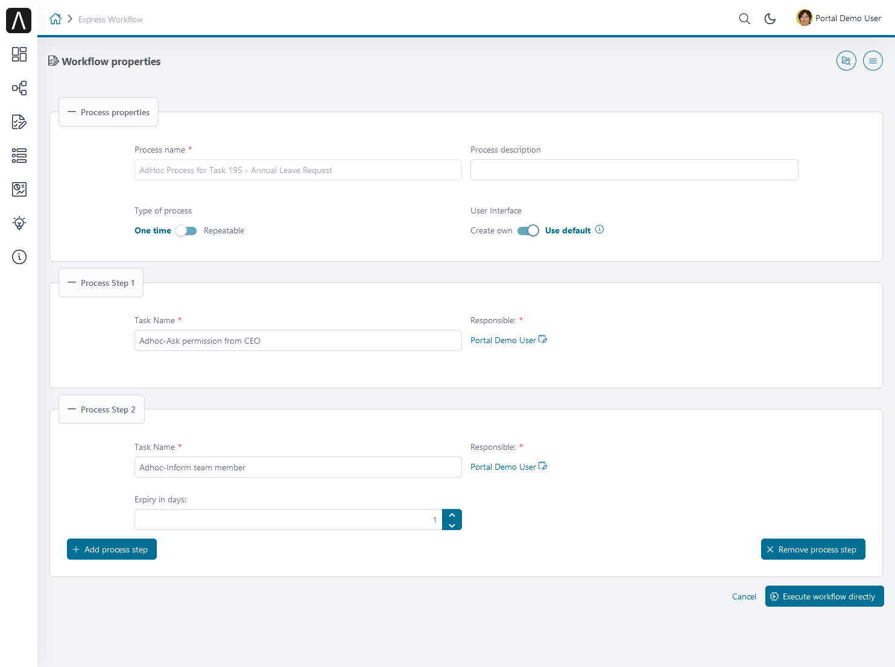

After starting the process, ad hoc tasks will be executed before your current task.

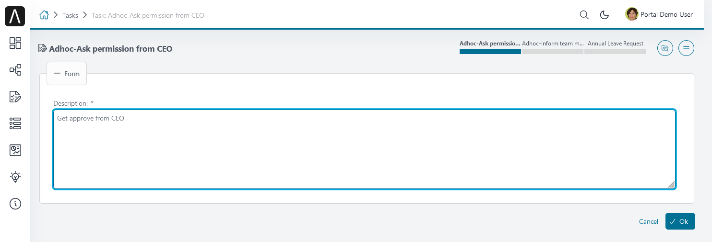

Finish all created ad hoc tasks to return to the original task

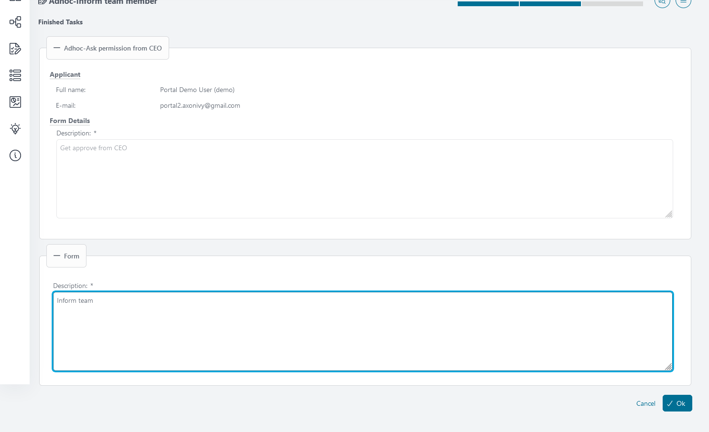

When you start your original task, you will see a summary of the ad hoc process in your task.

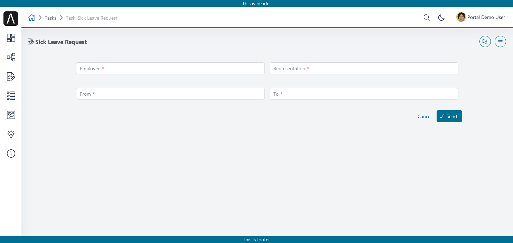

You can view the history again by clicking the menu icon, then click on **Adhoc history**.

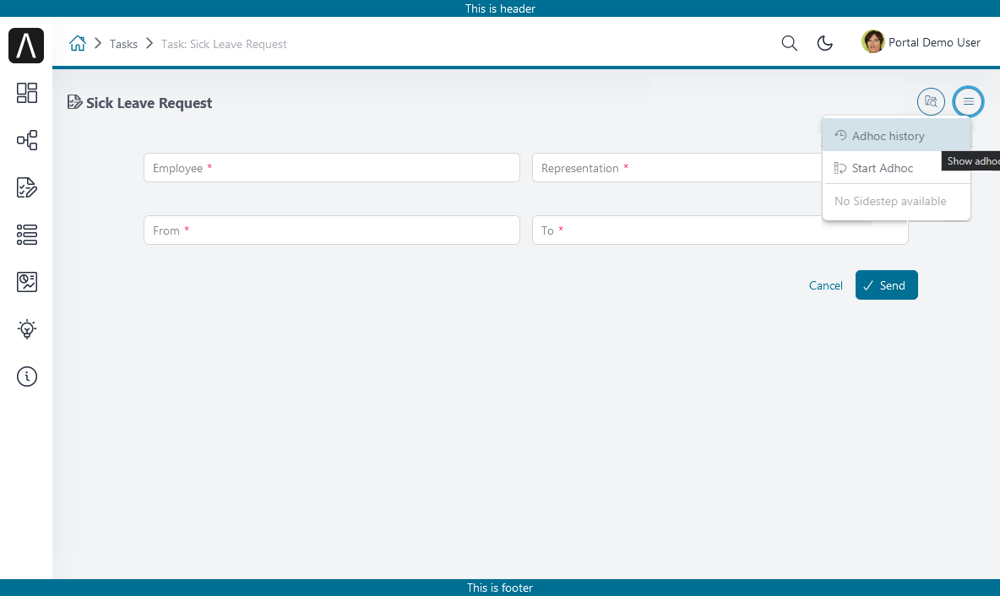