# Axon Ivy Express

Axon Ivy Express ist ein Zusatzmodul für das Axon Ivy Portal. Als
Geschäftsanwender können Sie damit Ihre Prozessanwendungen erstellen und mit
Ihren Kollegen teilen. Diese Funktionen werden auch als
No-Code-Anwendungsplattformen oder Citizen Developer-Plattformen bezeichnet.
Daher ist es das perfekte Werkzeug, um Ihre Prozesse zu digitalisieren und
Standard, Zuverlässigkeit und Rückverfolgbarkeit zu schaffen. Axon Ivy Express:

   * Ermöglicht Geschäftsanwendern die Erstellung von Prozessen ohne
     IT-Hintergrund.
   * Automatisiert Geschäftsprozesse ohne Beteiligung der IT-Abteilung.
   * Unterstützt alle Standardfunktionen wie E-Mail-Benachrichtigungen,
     Aufgabenübertragung usw.
   * Verfügt über ein Import-Tool, mit dem Sie Ihre No-Code-Geschäftsprozesse an
     Low-Code- oder Pro-Code-Entwickler übergeben können.

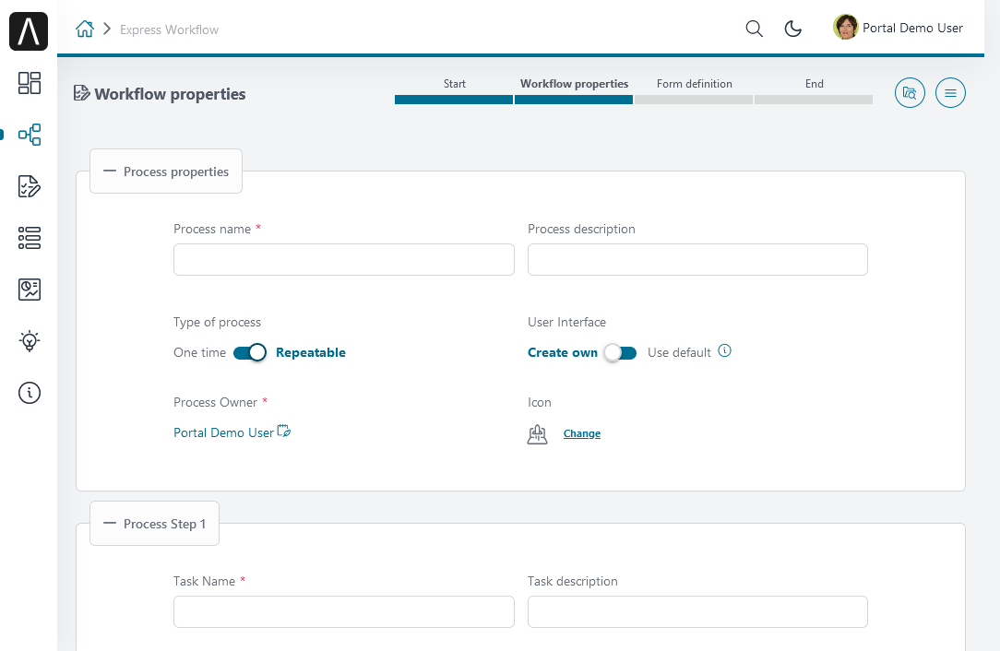

## Demo

### Erstellen Sie einen neuen Express-Prozess.

1. Starten Sie die Axon Ivy-Engine.
2. Öffnen Sie die Seite „ **-Prozesse“**.
3. Klicken Sie auf „ **“ (Express-Verwaltung) „** “ (Express-Verwaltung), um zum
   Express-Verwaltungs-Dashboard zu gelangen.

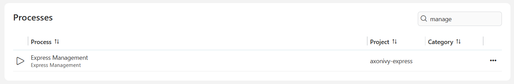

4. Klicken Sie im Express-Management-** unter „ **“ auf die Schaltfläche „
   **Create** “ ( erstellen).

5. Die Seite „ **-Workflow-Eigenschaften“** wird geöffnet.

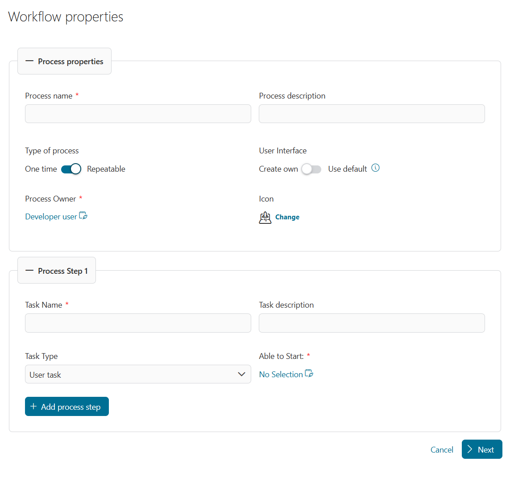

#### Workflow-Eigenschaften definieren

1. **Definieren Sie den Typ des Prozesses „ **“ ( ):

   * Verwenden Sie die Option „ *“ „One time* “, wenn Sie den Vorgang nur einmal
     ausführen möchten.
   * Verwenden Sie die Option „ *“ (Wiederholbare Vorgänge) „Repeatable* “
     (Wiederholbare Vorgänge), wenn Sie den Vorgang für die wiederholte
     Verwendung speichern möchten. Der Vorgang wird in der Tabelle auf der Seite
     „ **“ (Express-Management) „** “ (Wiederholbare Vorgänge) angezeigt.

2. Definieren Sie Ihre Benutzeroberfläche „ **“**:

   * * Mit der Option „ *“ („Eigene Benutzeroberfläche erstellen“) können Sie
     für jeden Prozessschritt einen eigenen Benutzerdialog erstellen.
   * Mit der Option „ *Use default* ” werden die Benutzerdialoge automatisch von
     Axon Ivy Express generiert.

3. Geben Sie einen beschreibenden Namen unter „ **-Prozessname” an.**
4. Sie können eine Beschreibung unter **Process description** hinzufügen. Wir
   empfehlen Ihnen dringend, die Beschreibung zu verwenden, um Details zu Ihrem
   Prozess anzugeben.
5. Klicken Sie auf den Link „ **“ (Schaltfläche „Löschen“ ändern). Ändern Sie
   „** “ (Symbol) neben „Icon“, um das für Ihren Prozess am besten geeignete
   Symbol auszuwählen.

6. Der erste Prozessschritt steht bereits zur Konfiguration bereit.
7. Sie können weitere Prozessschritte über die Schaltfläche „ **“ hinzufügen.
   Prozessschritt hinzufügen**
8. Sie können unnötige Prozessschritte über die Schaltfläche „ **“
   (Prozessschritt entfernen) löschen.**
9. Für jeden Prozessschritt:

   * Wählen Sie den Aufgabentyp „ **“ aus.**

     | **Aufgabentyp**                | **Beschreibung**                                                                                                                                                     |
     | ------------------------------ | -------------------------------------------------------------------------------------------------------------------------------------------------------------------- |
     | **Benutzeraufgabe**            | Für diese Aufgabe kann der Benutzer eine Benutzeroberfläche definieren.                                                                                              |
     | **Benutzeraufgabe mit E-Mail** | Zusätzlich zu den normalen Benutzeraufgaben kann der Benutzer direkt aus dem Axon Ivy Portal eine E-Mail versenden, ohne zu einem anderen System wechseln zu müssen. |
     | **Informationen E-Mail**       | Diese E-Mail kann vom Ersteller des Express-Workflows definiert werden und wird automatisch ohne Benutzeraktion versendet.                                           |
     | **Genehmigung**                | Dieser Aufgabentyp erstellt eine Genehmigungsaufgabe.                                                                                                                |

   * Geben Sie einen beschreibenden Namen unter „ **“ (Aufgabenname) an.**
   * Geben Sie eine optionale Beschreibung in „ **” (Aufgabenbeschreibung) an.**

10. Für *Einmaliger Prozess vom Typ „* “ (Prozess starten). Der erste
    Prozessschritt definiert die Benutzer oder Rollen unter „ **“ (Benutzer oder
    Rollen). Kann „** “ (Prozess starten) starten, wer kann den Prozess starten?

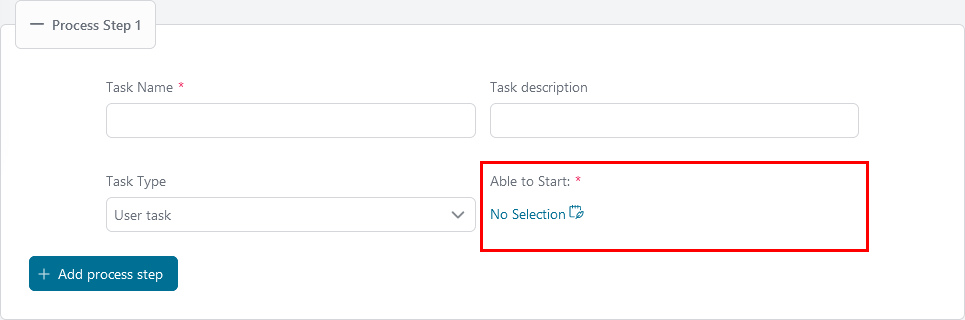

11. Für alle anderen Prozessschritte definieren Sie den Benutzer oder die
    Rollen, die für die Ausführung der Aufgabe in „ **“ verantwortlich sind.
    Verantwortlicher**.

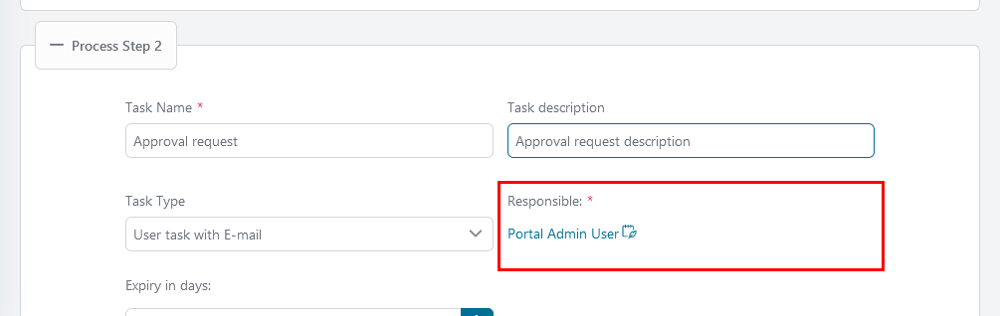

12. Legen Sie für jeden Prozessschritt außer dem ersten die Zeit bis zum Ablauf
    der Aufgabe in „ **“ (Ablauf in Tagen) fest.**
13. Nachdem Sie alle Schritte definiert haben, klicken Sie auf die Schaltfläche
    „ **“ (Nächste Konfigurationseinstellungen) „Next** “ (Nächste
    Konfigurationseinstellungen), um die Details der einzelnen Schritte zu
    konfigurieren.

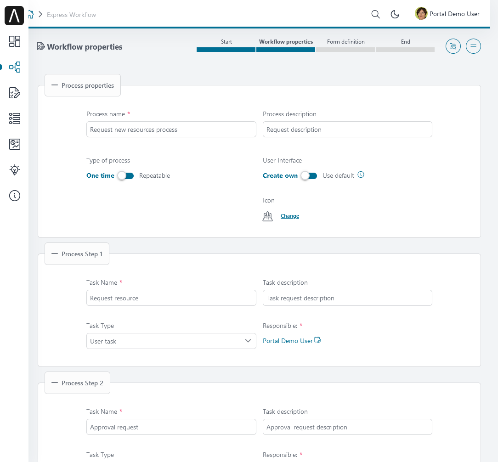

#### Prozessschritte konfigurieren

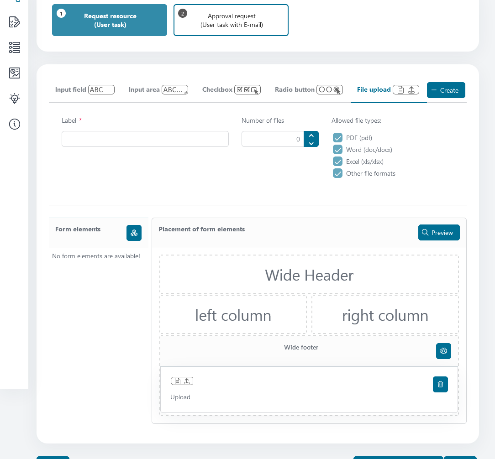

Wenn der Express-Prozess einen Schritt vom Typ „ **” (Benutzeraufgabe)** oder „
**” (Benutzeraufgabe mit E-Mail)** enthält, wird die Seite „ **”
(Formulardefinition)** geöffnet. Mit diesem Editor können Sie eine
Benutzeroberfläche für jede Aufgabe der genannten Typen erstellen. Die Seite „
**” (Formulardefinition)** enthält bereits die erforderlichen UI-Elemente, die
Sie frei zur Benutzeroberfläche des Prozessschritts hinzufügen können.

| **UI-Element**       | **Beschreibung und Optionen**                                                                                                                                     |
| -------------------- | ----------------------------------------------------------------------------------------------------------------------------------------------------------------- |
| **Eingabefeld**      | Eingabefeld für Text, Zahlen oder Datumsangaben   – Textfeld   – Zahlenfeld   – Datumsauswahl                                                            |
| **Eingabebereich**   | Texteingabefeld zwischen 1 und 10 Zeilen                                                                                                                          |
| **Kontrollkästchen** | Liste der Elemente, die dem Benutzer eine Mehrfachauswahl ermöglichen                                                                                             |
| **Optionsfeld**      | Liste der Elemente, die dem Benutzer eine einmalige Auswahl ermöglichen                                                                                           |
| **Datei hochladen**  | Stellt dem Benutzer einen Datei-Hochladen-Dialog zur Verfügung. Sie können Folgendes definieren:   – Zulässige Dateitypen   – Anzahl der zulässigen Anhänge |

1. Wählen Sie ein UI-Element aus und konfigurieren Sie es. Jedes UI-Element hat
   seine eigenen Konfigurationen. Wenn Sie beispielsweise ein Eingabefeld „
   **“** hinzufügen möchten, können Sie es wie folgt konfigurieren:

   * Geben Sie einen beschreibenden Namen für die Eingabe in „ **-Bezeichnung“
     an.**
   * Wählen Sie den Eingabetyp unter „ **“ aus. Eingabetyp**
   * Geben Sie an, ob die Eingabe für dieses Datenelement erforderlich ist,
     indem Sie den Schalter umlegen **Dieses Feld ist erforderlich.**

2. Nachdem Sie die Einstellungen konfiguriert haben, klicken Sie auf die
   Schaltfläche „ **Create** “, um das UI-Element zur Liste „ **Form elements**
   “ hinzuzufügen.
3. Für jedes UI-Element in der Liste „ **Formelemente** ” können Sie auf die
   Schaltfläche „Papierkorb” klicken, um es zu löschen.
4. Um die Position der UI-Elemente im Layout des Prozessschritts zu
   konfigurieren, ziehen Sie jedes UI-Element aus der Liste „ **Formelemente“**
   in einen der Bereiche des Abschnitts „ **Platzierung von
   Formularelementen“**.
5. Klicken Sie oben im Abschnitt „ **Placement of form elements** ” auf die
   Schaltfläche „ **Preview** ”, um die Vorschau-Version anzuzeigen.
6. Für die Schritte vom Typ „ **“ Informationen E-Mail** wird stattdessen der
   E-Mail-Editor angezeigt. Hier können Sie Informationen für den E-Mail-Schritt
   konfigurieren.

   * **E-Mail-Adresse**: E-Mail-Adresse der Empfänger. Durch Kommas trennen.
   * **Antwort an**: Die E-Mail-Adresse für die Antwort. Dieses Feld ist
     optional.
   * **Betreff-**: Der Betreff der E-Mail.
   * **E-Mail-Text**: Inhalt der E-Mail.
   * **Anhang**: Anhänge, die Sie zusammen mit der E-Mail versenden möchten.
     Dieses Feld ist optional.

7. Wenn Sie die Konfiguration der Benutzeroberfläche für einen Schritt
   abgeschlossen haben, klicken Sie auf die Schaltfläche „ **“ (Nächste
   Konfiguration) „Next“ (Weiter) „** “ (Konfiguration), um den nächsten Schritt
   zu definieren.

#### Express-Geschäftsübersicht

Seit Version 12.0.0 kann Axon Ivy Express unabhängig von Axon Ivy Portal
betrieben werden. Für die Verwaltung von Axon Ivy Express-Fällen und -Aufgaben
wird jedoch dringend empfohlen, das Portal zu verwenden. Mit dem Portal können
Sie die Zusammenfassungsdaten jedes Express-Falls einsehen, indem Sie im Portal
auf die Seite „ **-Geschäftsdaten** ” dieses Falls zugreifen.

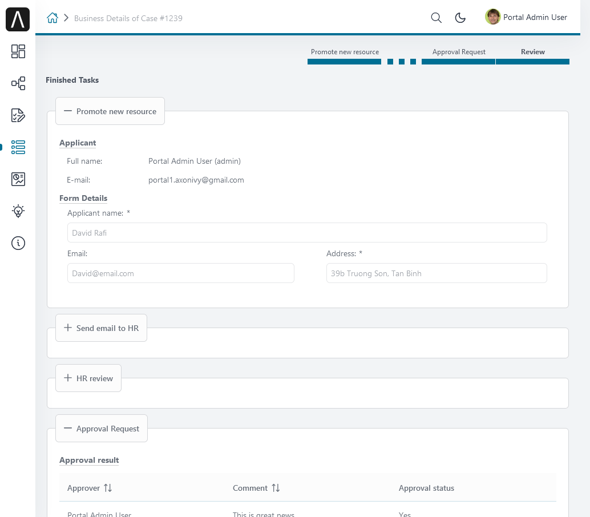

#### Express Management

Mit Express Management können Sie Express-Prozesse effizient verwalten. Darüber
hinaus können Sie Express-Workflows mithilfe von JSON-Dateien
importieren/exportieren.

Um alle Funktionen der Express-Verwaltungsseite nutzen und alle Express-Prozesse
starten zu können, müssen Ihnen die Rollen „ **” und „AXONIVY_EXPRESS_ADMIN”
zugewiesen sein.**.

##### Anleitung: Exportieren eines Express-Workflows

1. Suchen Sie in der Tabelle „Express-Workflows“ den gewünschten Workflow und
   klicken Sie auf dessen Menüsymbol.
2. Wählen Sie aus dem Dropdown-Menü „ **“ (Deutsch für Readme-Dateien) und
   „Export** “ (Deutsch für Readme-Dateien).

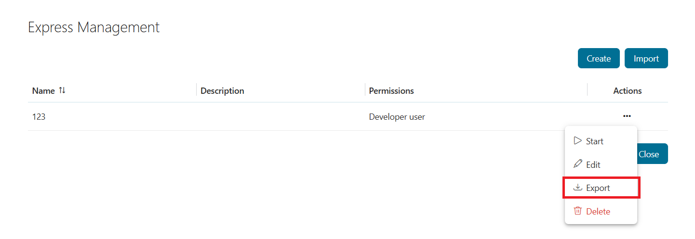

Der Workflow wird automatisch als JSON-Datei heruntergeladen.

****Wichtiger Hinweis: Die exportierte Datei ist ein JSON-Dokument, das die
Version-Informationen-ph-0000@deepl.internal von Axon Ivy Express und die
Express-Prozessdaten enthält. Bearbeiten Sie diese Datei nicht manuell, um die
Datenintegrität zu gewährleisten.

##### Anleitung: Importieren eines Express-Prozesses

Mit der Funktion „Import Express Process“ kann der Administrator
Express-Prozesse aus einer JSON-Sicherungsdatei in das Portal importieren.
Klicken Sie auf die Schaltfläche „ **“ (Import-** ) „Import Express Processes“
(Express-Prozesse importieren), woraufhin das Dialogfeld „Import Express
Processes“ (Express-Prozesse importieren) angezeigt wird. Sie können auf die
Schaltfläche „ **“ (Import-** ) „Select JSON File“ (JSON-Datei auswählen)
klicken und die Express-JSON-Datei auswählen, die die zu importierenden
Workflows enthält.

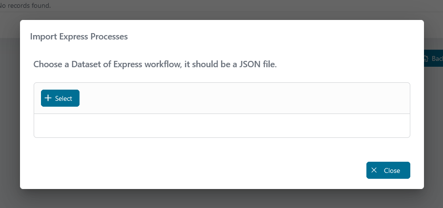

Klicken Sie dann auf die Schaltfläche „ **“ „Deploy** “ und warten Sie, bis der
Bereitstellungsprozess abgeschlossen ist.

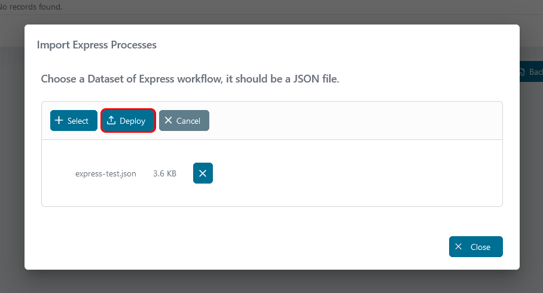

Nach Abschluss des Bereitstellungsprozesses wird ein Ausgabeprotokollfeld
angezeigt. Dort können Sie alle während des Bereitstellungsprozesses gesammelten
Informationen einsehen.

Wenn der Bereitstellungsprozess erfolgreich ist, werden Ihre Workflows
importiert und können von einem Administrator überprüft und/oder bearbeitet
werden, bevor sie einsatzbereit sind.

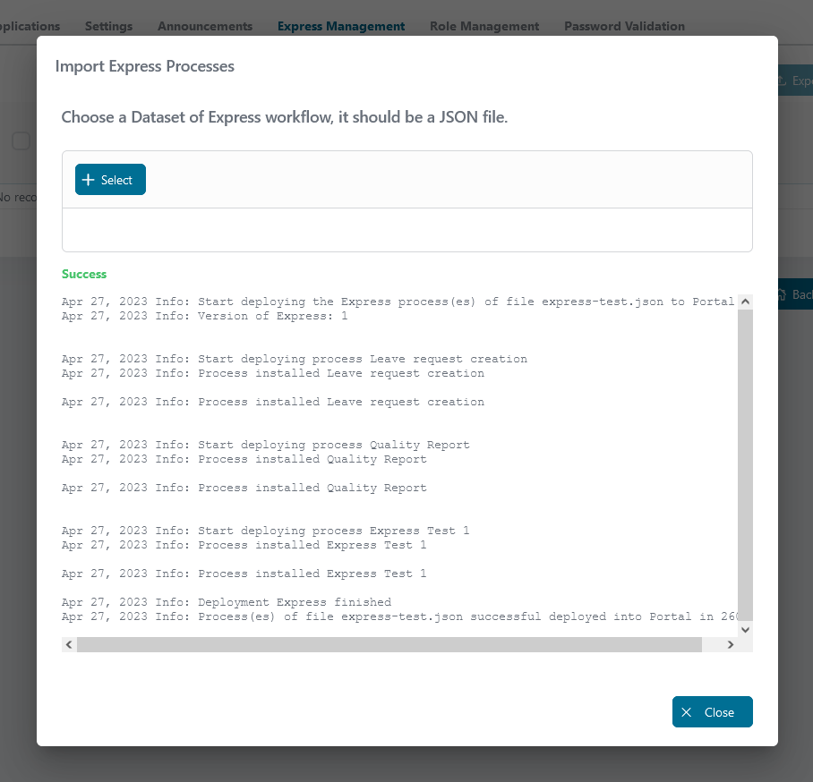

## Migration

### Migrieren Sie zu 12.0.0

**Axon Ivy Express** ist jetzt eine eigenständige Anwendung und benötigt nicht
mehr Axon Ivy Portal. Außerdem wurde es aktualisiert, um es an die neueste
Struktur der Axon Ivy Marktplatz-Projektvorlage anzupassen.

****Wichtiger Hinweis: In früheren Versionen von Express erstellte Workflows
sind nicht mit Axon Ivy Express 12 kompatibel. Um Ihre alten Workflows weiterhin
zu verwenden:

   1. Exportieren Sie alle Workflows aus der vorherigen Version.

   2. Importieren Sie diese mit der Funktion [Import
      workflow](#howto-import-an-express-process) in das neue Axon Ivy Express.
